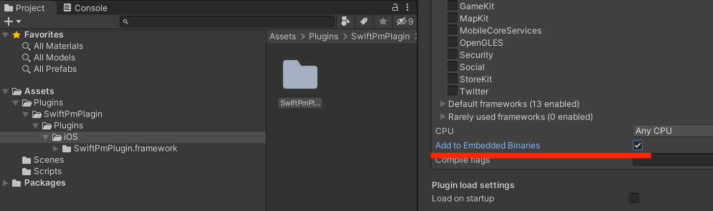

# Unity Native Plugin Example for iOS & macOS using Swift

Unity supports native plugin, which are libraries of native code written in Swift.  
Native plugin make possible for code written in C# to call functions from these libraries.  
Check [this document](docs/Making.md) for detailed Native Plugin creation instructions.  

# Build Swift Libraries

Check [Makefile](Makefile) for command details.

## Build Framework for iOS

```
$ make framework
```

This should result in `SwiftPmPlugin.framework` being generated in `Build`.  
Copy the built framework into your Unity project's `Assets/Plugins/iOS`.  
Enable `Add To Embedded Binaries` in the Unity Inspector of `SwiftPmPlugin.framework`.



## Build Bundle for macOS

```
$ make bundle
```

This should result in `SwiftPmPlugin.bundle` being generated in `Build`.  
Copy the built bundle into your Unity project's `Assets/Plugins/macOS`.  
Need to restart unity to load the new bundle.  

# Swift Interface Example for Unity

Check [UnityInterface.swift](Sources/SwiftPmPlugin/UnityInterface/UnityInterface.swift) for details.

```swift
@_cdecl("swiftPmPlugin_toNumber")
public func swiftPmPlugin_toNumber(_ stringPtr: UnsafePointer<CChar>?) -> Int64 {
    let str = String(cString: stringPtr!)
    return Int64(Int(str) ?? 0)
}
```

# Call Swift Function in C#

Check [SwiftPmPlugin.cs](Examples/UnityExample/Assets/Plugins/SwiftPmPlugin/Scripts/SwiftPmPlugin.cs) for details.

```c#
[DllImport(libName)]
private static extern long swiftPmPlugin_toNumber(string stringNumber);

public static long ToNumber(string stringNumber)
{
    return swiftPmPlugin_toNumber(stringNumber);
}
```
