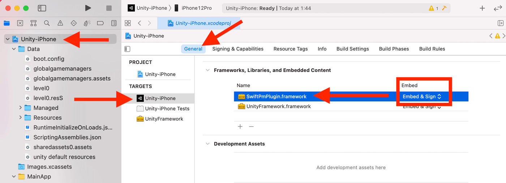

# Create an iOS Native Plugin for Unity using Swift
* Unity Native Plugin allows your game to embed features of the OS that are not provided by default.
* You can integrate Bluetooth, MP4 video creation, and more into your game.
* Use the Swift Package Manager to make the framework and embed it in Unity.
* __Benefits of Making Framework__
  * Configuration is completed in Unity's Inspector.
  * You can use Swift app targets to check the working of your plugins.
    * No need to build unity to check the working.

# About Example
* Implement a Native Plugin that converts a number of type string to type long.
* The function `swiftPmPlugin_toNumber` defined with `[DllImport("__Internal")]` is the target function.
* This function also exists in C#, but you can use the iOS function in the same way.

```c#
public class Cube : MonoBehaviour
{
    // target function
    [DllImport("__Internal")]
    private static extern long swiftPmPlugin_toNumber(string numberString);

    void Update()
    {
        // calling
        Debug.Log("number is: " + swiftPmPlugin_toNumber("30"));
    }
}
```

# Implement the Native Plugin
* Implement using the Swift Package Manager and output the Framework
* Make a SwiftPmPlugin.framework that implements `swiftPmPlugin_toNumber`.

## Environment
* maxOS 11.3.1
* Xcode 12.5
* Swift 5.4.0
* Unity 2020.3.5f1

## Swift Package Manager
* Initialize the package with type=library and package name.
* Open Package.swift.
* Xcode will launch, edit SwiftPmPlugin.swift.

```
swift package init --type=library --name=SwiftPmPlugin
open Package.swift
```

## Implement SwiftPmPlugin.swift
* Implement the logic in Swift.
* Create a toNumber function in the SwiftPmPlugin class to convert a string to a number.

```swift
class SwiftPmPlugin {
    var text = "Hello, World!"
    static func toNumber(string: String) -> Int {
        return Int(string) ?? 0
    }
}
```

## Make a function called in C#.
* Make a function attributed to `@_cdecl`.
* Convert the char array argument to Swift's String type.
* Get an Int value from a string using SwiftPmPlugin.toNumber.
* Convert the return value to Int64, because C# expects long type.

```swift
@_cdecl("swiftPmPlugin_toNumber")
public func swiftPmPlugin_toNumber(_ stringPtr: UnsafePointer<CChar>?) -> Int64 {
    let str = String(cString: stringPtr!)
    return Int64(SwiftPmPlugin.toNumber(string: str))
}
```

## Build the Framework
* Generate xcodeproj from SwiftPM.
* Build the framework from xcodeproj using xcodebuild.
* SwiftPmPlugin.framework is created in the directory you specified.

```
swift package generate-xcodeproj --skip-extra-files
xcodebuild -project SwiftPmPlugin.xcodeproj -scheme SwiftPmPlugin-Package -configuration Release -sdk iphoneos CONFIGURATION_BUILD_DIR=.
```

# Build in Unity
## Configure the Framework
* Create `Plugins/iOS/` and place SwiftPmPlugin.framework in it.
* Enable Add To Embedded Binaries in the Unity Inspector of SwiftPmPlugin.framework.
* For more information -> https://docs.unity3d.com/2020.3/Documentation/Manual/PluginInspector.html


## Build an iOS app
* Build the app for iOS in Unity and run it.
* If it doesn't work, check the following
  * Unity-iPhone > General > Frameworks, Libraries, and Embedded Content.
  * SwiftPmPlugin.framework exists and is set to Embed & Sign.
  * If it's incomplete, you can add it manually and set it to.
  
    

# Create a Native app target for Framework development.
* Not required for Unity Native Plugin.
* This is just a tip to make Framework development more convenient.
* It's hard to go through the cycle of Framework build -> Unity build -> iOS to check if plugins works.
* So I think it's more effective to make an app target and develop plugins.

## Create xcworkspace
* Create the SwiftPmPlugin.xcworkspace.
* Import the Package.
* Create an app target.
* The language can be either Objective-C or Swift.

* Add SwiftPmPlugin to the "Frameworks, Libraries, and Embedded Content" section of your app target.

* Calling from Objective-C

```objective_c
#import "ViewController.h"
@import SwiftPmPlugin;
@interface ViewController ()
@end
@implementation ViewController
- (void)viewDidLoad {
    [super viewDidLoad];
    // Do any additional setup after loading the view.
    
    NSLog(@"value: %lld", swiftPmPlugin_toNumber("20"));
}
@end
```

* Calling from Swift

```swift
import SwiftUI
import SwiftPmPlugin

struct ContentView: View {
    var body: some View {
        Text("number: \(swiftPmPlugin_toNumber("20"))")
            .padding()
    }
}
```

# Conclusion
* Implemented in Swift, managed by SwiftPM, and tested in a Native app for efficient development.
